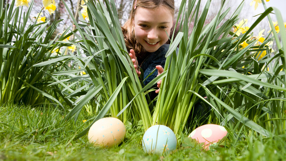
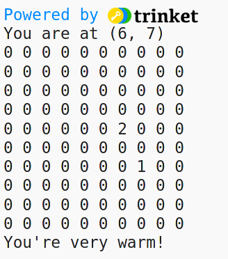
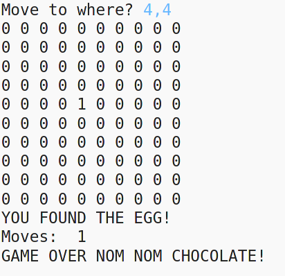

# Code Club Slough - Easter Egg Hunt



## Introduction

In this project, we will search for a hidden Easter egg on in our digitised "garden". This uses feedback from the programme to tell us if we are going in the right direction. If we say "warmer", we are going in the right direction. If we say "colder", we are in the wrong place!



## Starter Template

Go to https://trinket.io/python/431a9487cc for the starter project and remix it to save to your Trinkets.

You will see some functions created for the project, and some libraries have been imported.

## Adding the Code

1. We need to create a map, with two positions: our position in the garden and the position of the hidden egg. Our garden is a 10 x 10 grid, so has 100 positions.

```python
eggFound = False

# Create a map
map = numpy.zeros((10,10),dtype=int)

# Random positions of me and the egg
mypos = (random.randint(0,9),random.randint(0,9))
egg = (random.randint(0,9),random.randint(0,9))

print("You are at", mypos)

```

2. Lets set our position to be a "1" amongst the zeros and for the position of the egg to be a "2". We can now show the positions and draw the map


```python
map[mypos]= 1
map[egg]=2

displayMap(map)

```

3. We want to know how near we are to the egg. The "getCloseness" Function will do that for us.

```python

getCloseness(mypos, egg)

```
Run the code a few times and you should see that the temperature varies according to how close the 1 and 2 are - how near you are to the egg.

Have a look at the code in functions.py that does the closeness. Can you see how it is working?

4. Moving around the garden. We now want to put in some coordinates and move to a new position. This game loop will make that happen. 
**Put in the new position as "x,y", for example 3,3**

```python

# Game Loop
moves = 0 
while not eggFound:
  goto = input("Move to where?")
  map[(mypos)]=0
  try:
    x = int(goto[0])
    y = int(goto[2])
  except ValueError:
    continue
  mypos = (x,y)
  map[mypos]=1
  displayMap(map)
  closeness = getCloseness(mypos, egg)
  moves = moves + 1
  print("Moves: ", moves)
  if closeness == 0: eggFound = True


print("GAME OVER NOM NOM CHOCOLATE!")
```


5. Finally, we don't want to see the egg! So comment that out (will be around line 20 of you code)

```python

#map[egg]=2

```
Now see how many moves it takes you to find the egg!

## Challenge

Try keeping a record of the fastest time (fewest moves) to find the egg. What about average and maximum moves?

_hint: you will need to have a loop to re-run the game or the memory will be wiped!_